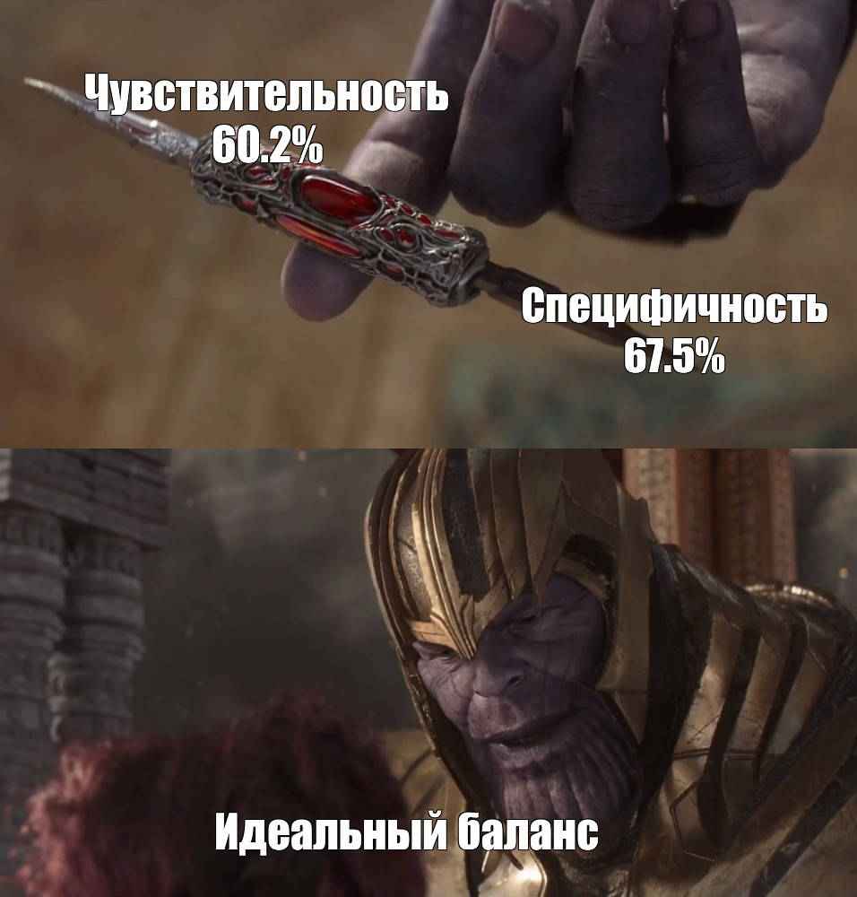

```{r setup, include=FALSE}
knitr::opts_chunk$set(echo = TRUE, warning = FALSE, error = FALSE)

lapply(c("ggplot2", "readxl", "psych", "glue", "tibble", 
         "stats", "tidyr", "stringr", "RColorBrewer", 
         "dplyr", "gtsummary", "pROC"), require, character.only=TRUE)
```

# Глава 1. Технические моменты.

## Читаем данные

```{r reading}
trauma <- read_excel("./trauma.xlsx")
head(trauma)
```

## Смотрим сводку

```{r svodka}
str(trauma)
```

Нет нужды в переменной `...1`. Также я сомневаюсь, что рост должен быть строковой переменной (необходимо проверить на наличие экзотических записей). Соображение на основании пояснительной нотации к данным -- перевести рост и массу к единицам системы СИ. Смерть переводим в факторную переменную.

```{r summary}
summary(trauma)
```

Сводка выглядит нормальной. Пациентов с нулевой массой тела или возрастом 500 лет не наблюдаю.

## Наводим порядок

Сначала разберемся с ростом. Хорошо бы оценить, почему он превратился в строку.

```{r height_check}
unique(trauma$Height) %>% head()
```

Кавычка после числа -- не тот герой, который нужен городу сейчас. Уберем и сделаем числом, а заодно и внесем все изменения, о которых говорили прежде.

```{r data correction}
trauma <- trauma %>% 
  mutate(
    Height = round(as.numeric(sub("\"", "", Height)) * 2.54, 0),
    Weight = round(Weight / 2.2, 0),
    Sex = as.factor(Sex),
    Death = factor(Death, levels = 0:1, labels = c("Survived", "Doesn't survived"))
  )

trauma$`...1` <- NULL
```

## Проверяем отсутствующие значения

```{r}
trauma %>% 
  is.na() %>% sum()
```

Аристотель говорил, что природа боится пустоты. Датасет по электросамокатам, видимо, тоже.

# Глава 2. Статотчет.

## 1.

### Пациенты со сниженным гемоглобином.

```{r}
trauma <- trauma %>% 
  mutate(
    hb_dec = case_when(
      (Sex == "Male" & Hb < 13.5) | (Sex == "Female" & Hb < 12) ~ "Decrease_Hb",
      (Sex == "Male" & Hb >= 13.5) | (Sex == "Female" & Hb >= 12) ~ "Normal_Hb",
    ) %>% as.factor()
  )
```

### Описательные статистики

Сначала смотрим на всех целиком

```{r}
trauma %>% 
  select(where(is.numeric) | where(is.factor) & !id) %>% 
  tbl_summary()
```

Обратим внимание, что пациентов со сниженным гемоглобином было 474 (46%), а с нормальным -- 550 (54%).

Потом отдельно для каждого пола.

```{r}
trauma %>% 
  select(where(is.numeric) | where(is.factor) & !id) %>% 
  tbl_summary(by=Sex) %>% add_p()
```

Женщин в выборке почти в два раза меньше. По исходным показателям антропометрических данных и гемоглобина (что нормально) группы по полу значимо не отличаются. Однако обращает на себя внимание тот факт, что женщины намного чаще демонстрировали снижение гемоглобина, однако мы не можем заключить, что это следствие падения с электросамоката, поскольку не имеем данных до ТТП (тротуарно-транспортного происшествия).

Сравним группы по исходу.

```{r}
trauma %>% 
  select(where(is.numeric) | where(is.factor) & !id) %>% 
  tbl_summary(by=Death, 
              percent = "row") %>% add_p()
                               
```

АД, шкалы комы и уровень гемоглобина отличаются в группе выживших и умерших. Также мы видим, что среди погибших чаще были лица с понижением уровня гемоглобина, и реже -- с нормальным.

## 2

Расчитаем ИМТ у пациентов.

```{r}
trauma <- trauma %>% 
  mutate(BMI = (Weight/((Height/100)^2)) %>% round(2))
```

Расчитаем средний ИМТ у пациентов.

```{r}
trauma %>% 
  select(BMI) %>% 
  summarise(mean = mean(BMI) %>% round(2),
            sd = sd(BMI) %>% round(2))
```

Точечная оценка среднего равна `26.1` кг/м2, и соответствует повышенной массе тела. Стандартное отклонение равно `2.58`.

Вычислим долю пациентов с ожирением (ИМТ \> 30) Говоря строго, здесь придется выполнять 2 отдельных вычисления, поскольку лица с ожирением имет ИМТ **\>=** 30. Но велика вероятность, что значения совпадут.

```{r}
# Доля лиц с ожирением
trauma %>%
  filter(BMI >= 30) %>% 
  nrow(.) / nrow(trauma)

# Доля лиц с ИМТ > 30
trauma %>% 
  filter(BMI > 30) %>% 
  nrow(.) / nrow(trauma)
```

При любом методе оценки получаем, что доля означенных лиц составляет 7.3 %

## 3

Проведем ROC-анализ для предсказания летального исхода в течение 24 часов по уровню гемоглобина

```{r, message=FALSE}
roc_hb_death <- trauma %>% 
  roc(Death ~ Hb, ., ci=TRUE)

roc_hb_death
```

По предварительным данным гемоглобин в группе контролей (выжившие) был выше, чем в группе случаев (погибшие). AUC составляет `70%`, доверительный интервал (`66.9-73.2`) не пересекает 50%, что говорит о том, что предсказательная ценность гемоглобина, как маркера предстоящей смерти существует. Однако относительно небольшая площадь под кривой свидетельствует о том, что тест достаточно часто будет и ошибаться.

Визуализируем ROC-кривую. ПРи написании кода для отображения ДИ на графике использован материал [по нижеслудющей ссылке](https://rpubs.com/vguillem/465086)

```{r rocauc, fig.width=7, fig.height=7}
# Небольшой костыль для визуализации диагональной линии (тест монетки)
diagonal <- data.frame(x=c(0,1),
                          y=c(1,0))

# Эти 3 строчки -- заимствование кода из источника выше
ciobj <- ci.se(roc_hb_death, specificities=seq(0, 1, l=100))
dat.ci <- data.frame(x = as.numeric(rownames(ciobj)),
                     lower = ciobj[, 1],
                     upper = ciobj[, 3])

roc_hb_death %>% 
  ggroc() + 
  geom_path(data=diagonal, 
            aes(x=x, y=y))+
  theme_bw()+
  labs(x = "Специфичность",
     y = "Чувствительность",
     title = "Рис. 1 ROC-AUC анализ предсказания\nлетального исхода по уровню гемоглобина")+
  theme(axis.text.x = element_text(size=16),
        axis.text.y = element_text(size=16),
        axis.title.x = element_text(size=19),
        axis.title.y = element_text(size=19),
        plot.title = element_text(size=22, hjust=0.5))+
  geom_ribbon(data = dat.ci, 
              aes(x = x, 
                  ymin = lower, 
                  ymax = upper), 
              fill = "green", alpha= 0.3)
```

Такая форма кривой -- достаточно резкий "взлет" кривой в районе 100% специфичности и пологая линия около 100% чувствительности -- может говорить о том, что крайние значения гемоглобина дают достаточно точный прогноз по выживаемости (очень маленькие -- плохой, большие -- хорошие), однако значения между ними с куда меньшим успехом предскажут верный исход.

## 4

Кажется, я нечаянно выполнил это задание в предыдущем пункте. Продублирую значения:

Площадь под кривой (AUC) = `0.7006`

95% двусторонний ДИ по DeLong = `0.6691-0.7321`

## 5

> Примечание. Исходно я по ошибке посчитал все не для Глазго, а для гемоглобина. На случай, если это покажется нужным, оставляю расчеты и для него.

### Расчет для ШК Глазго

Поберем порог для наилучшего определения смертности в течение суток по баллу шкалы Глазго. Будем считать, что нам важен оптимальный баланс чувствительности и специфичности, а не что-то с уклоном в большую чувствительность/специфичность.

```{r, message=FALSE}
roc_gsc_death <- trauma %>% 
  roc(Death ~ GSC, ., ci=TRUE)

roc_gsc_death
```

```{r}
roc_gsc_death %>% 
  coords(x = "best", best.method = "closest.topleft") %>% round(3)
```

Баллы по ШК Глазго не могут быть дробными. Интерпретация будет звучать так: если баллы по ШК Глазго больше или раны 8, прогноз благоприятный. Если значение ШК Глазго лежит в интервале от 3-х до 7-ми, прогноз неблагоприятный. Мы будем правильно предсказывать неблагоприятный прогноз в `80.8%` случаев, а верно предсказывать благоприятный -- в `85.6%` случаев.

Попробуем иной подход.

```{r}
roc_gsc_death %>% 
  coords(x = "best", best.method="youden") %>% round(3)
```

Результат аналогичен и для метода *Youden*.

### Расчет для гемоглобина

Поберем порог для наилучшего определения смертности в течение суток по уровню гемоглобина. Будем считать, что нам важен оптимальный баланс чувствительности и специфичности, а не что-то с уклоном в большую чувствительность/специфичность.

```{r}
roc_hb_death %>% 
  coords(x = "best", best.method = "closest.topleft") %>% round(3)
```



Считаем, что наша отсечка -- уровень гемоглобина `13.15 г/дл` Чувствительность при этом равна `60,2%`, а специфичность -- `67,5%`.

Попробуем другой подход.

```{r}
roc_hb_death %>% 
  coords(x = "best", best.method="youden") %>% round(3)
```

При использовании метода *Youden* порог Hb устанавливается на отметке в `13.65`. При этом специфичность сильно возрастает до `85.3%` (мы довольно редко пророчим гибель незадачливым самокатчикам, которые на деле останутся в живых), но сильно падает чувствительность -- до `46,5%`. Как следствие, получаем излишне оптимистичный прогноз для тех, кто в реальности погибнет.

## 6

Проверим, какой из параметров обладает наибольшей ROC-AUC.

```{r, message=FALSE}
# Исключаем айди, так как эта переменная, вероятнее всего, не несет медицинского смысла
trauma %>% 
  select(where(is.numeric) & !id | Death) %>%  
  pivot_longer(cols = !Death, names_to = "Variable") %>% 
  group_by(Variable) %>%
  summarise(AUC = roc(Death, value, ci = T)$ci[2] %>% round(2),
              AUC_lCI = roc(Death, value, ci = T)$ci[1] %>% round(2),
              AUC_uCI = roc(Death, value, ci = T)$ci[3] %>% round(2))
```

Лучшие результаты показали две шкалы ком. Это выглядит логичным с той точки зрения, что они являются интергративным показателем общей тяжести состояния (а не только снижения концентрации эритроцитов, как в случае с уровнем гемоглобина).

Худшие результаты показали рост, масса тела, ИМТ и возраст. У всех перечисленных параметров доверительный интервал площади под кривой включает 0.5, что означает, что предсказательная сила теста весьма близка к столь любимому статистиками методу, как подбрасывание монетки. Ситуация с ростом, массой тела и производной от них вполне объяснима, поскольку прогноз обусловлен в первую очередь тяжестью состояния, а не антропометрией. Ситуация с возрастом выглдяит более неожиданно, поскольку интуитивно существует гипотеза о том, что при одинаковых по тяжести повреждениях вероятность выжить выше у более молодых пациентов.

Попробуем дополнительно разбить пациентов на возрастные группы (молодые и зрелые по ВОЗ [да, я помню о ненаходимой, но всеми используемой классификации, но для быстрого решения отсечка в 45 лет выглядит вполне удобной]) и посмотреть на ROC-AUC в каждой из них.

```{r, results='hide', message=FALSE}
age_roc <- trauma %>% 
  select(Age, Death) %>% 
  mutate(Age_group = case_when(
    Age < 45  ~ "Young",
    Age >= 45 ~ "Not so young"
  )) %>% 
  group_by(Age_group) %>% 
  summarise(AUC = roc(Death, Age, ci = T)$ci[2] %>% round(2),
              AUC_lCI = roc(Death, Age, ci = T)$ci[1] %>% round(2),
              AUC_uCI = roc(Death, Age, ci = T)$ci[3] %>% round(2)) %>% 
  ungroup()
```
```{r}
age_roc
```


Нет, интуиция говорит нам ложные вещи. Внутри каждой из подгрупп мы снова получаем информацию об абсолютно неинформативном прогностическом значении возраста (ожидалось, что в старшей возрастной группе мы можем получить что-либо более интересное, но нет).
